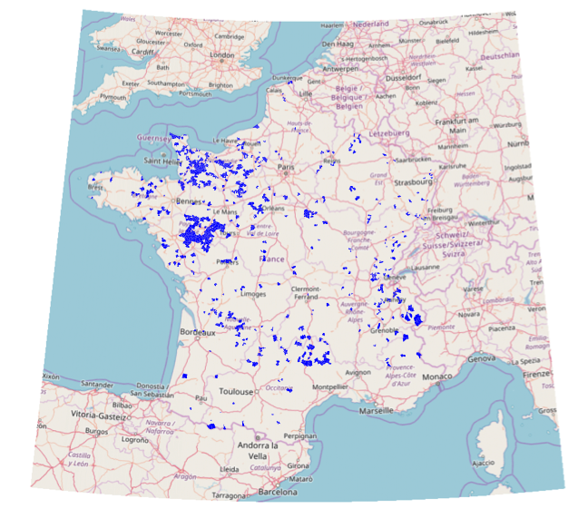

--- 
title: "Prévoir les fusions de communes"
author: "Eglantine Bigot-Haon, Vivien Roussez, Khouloud Zine Elabidine aka les **datagourdes**"
date: "`r Sys.Date()`"
site: bookdown::bookdown_site
documentclass: book
bibliography: [book.bib, packages.bib]
biblio-style: apalike
link-citations: yes
description: "Rapport pour la formation du CEPE en datascience"
---

```{r setup, include=FALSE}
rm(list=ls())
knitr::opts_chunk$set(echo = F, message=F, error=F,warning=F)
```

```{r}
require(tidyverse)
require(spdep)
require(sf)
require(data.table)
require(FactoMineR)
require(parallel)
require(cartography)
require(knitr)
require(rpart)
require(visNetwork)

# datacomm <- fread("../Sources/Base_communes.csv",sep=";",dec=",",colClasses = c("REG"="chr"))
# load("../Base.RData")
# fus <- filter(base,fusion==1) %>% select(first,second) %>% unlist() %>% unique()
# mapCom <- mutate(mapCom,fusion=0)
# mapCom$fusion[fus] <- 1
# typoLayer(x=mapCom,var="fusion",border = NA,col = c("lightgrey","blue"),legend.pos = "n")
```

<style> body {text-align: justify}  </style>


# Introduction

## Pourquoi ce sujet ?



En 2015, le projet de loi sur l'amélioration de la commune nouvelle est adopté. La même année, la loi pour une Nouvelle Organisation territoriale de la République (Notr) renforce les compétences des Régions et établissement publics de coopération intercommunale (EPCI, soit les communautés d'agglomération, de communes, etc...). Ces mesures  interviennent dans un contexte de réformé territoriale visant à rationaliser les dotations de l'Etat afin d'augmenter la capacité des régions à entrer dans la compétition internationale, et de ernforcer la coopération entre communes afin de développer la mutualisation des services et réaliser des économies d'échelle.

Par ailleurs, la France, avec près de 36 800 communes en 2015, regroupe à elle seule un tiers des communes de l’Union européenne. La plupart sont très petites (voir shiny), ce qui limite de fait les capacités d'action. C'est pourquoi, en plus de la loi NOTR, une loi concernant les communes nouvelles a été adoptée en 2015, et incite les communes, notamment les petites, à fusionner, avec une incitation fiscale assez forte : alors que les dotations de l'Etat baissent de façon générale, les communes ayant fusionnée voient leurs dotations gelées pour 3 ans. 

Depuis l'adoption de cette loi, on comptabilise près de 1750 fusions de communes, ce qui représente une baisse significative du nombre de collectivité, même si cela reste relativement modeste par rapport à la baisse du nombre de municipalités dans les autres pays européens, amorcée dès 1950 (jusqu'à -92 % au Danemark !).

## Pourquoi pas les autres ?

Nous avions commencer à travailler sur deux autres sujets :

- La réutilisation des jeux de données mis à disposition sur data.gouv.fr
- Travail su le traffic et les accidents dans Paris à partir des données de opendata.paris.fr

Pour le premier sujet, nous avons reculé après avoir constaté que les fichiers mis à disposition changeaient tous les jours, et surtout était systématiquement incomplets (manque de lignes). Sur le second sujet, la difficulté était de trouver un "individu statistique"" sur lequel faire nos modélisation. Certaines données étaient géocodées au "tronçon", d'autres à la rue, d'autres à l'XY... Le temps de traitement de la donnée aurait été trop important.

